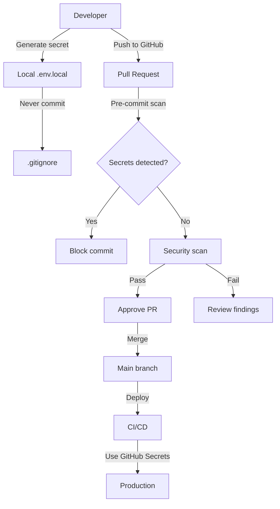

# SecureConnect Security Secrets Audit Report

**Audit Date:** 2026-01-21  
**Auditor:** Senior DevSecOps Engineer  
**Scope:** Full repository scan for exposed secrets, credentials, and sensitive data

---

## Executive Summary

This audit identified **CRITICAL security vulnerabilities** in the SecureConnect repository. The most severe issues involve:

1. **Committed .env.local file** with weak credentials
2. **Exposed Firebase Project ID** in docker-compose configuration
3. **Hardcoded weak secrets** in configuration files
4. **Incomplete .gitignore** allowing sensitive files to be committed

**Overall Risk Level:** 🔴 **CRITICAL**

---

## 1. Security Risk Assessment

| Risk ID | Severity | Category | Impact | Likelihood | Risk Score |
|----------|----------|----------|--------|------------|------------|
| SEC-001 | CRITICAL | Committed Secrets | Complete system compromise | High | 9.5/10 |
| SEC-002 | HIGH | Firebase Exposure | Firebase project access | Medium | 7.5/10 |
| SEC-003 | MEDIUM | Weak Defaults | Credential compromise | Low | 5.0/10 |
| SEC-004 | MEDIUM | Git Issues | Future secret leaks | Medium | 6.0/10 |

---

## 2. List of Exposed Secrets

### 2.1 CRITICAL: Committed .env.local File

**File:** [`secureconnect-backend/.env.local`](secureconnect-backend/.env.local)  
**Status:** ❌ **COMMITTED TO VERSION CONTROL**

| Secret | Value | Risk |
|--------|-------|------|
| `TURN_PASSWORD` | `turnpassword` | Weak password |
| `MINIO_ACCESS_KEY` | `minioadmin` | Default credentials |
| `MINIO_SECRET_KEY` | `minioadmin` | Default credentials |
| `JWT_SECRET` | `super-secret-key-please-use-longer-key` | Weak signing key |
| `ICE_SERVERS` | Contains `turnpassword` | Credential exposure |

**Impact:** 
- Anyone with repository access can forge JWT tokens
- MinIO storage can be accessed with default credentials
- TURN server can be compromised

### 2.2 HIGH: Firebase Project ID Exposure

**File:** [`secureconnect-backend/docker-compose.yml`](secureconnect-backend/docker-compose.yml:231-235)

```yaml
environment:
  - PUSH_PROVIDER=firebase
  - FIREBASE_PROJECT_ID=chatapp-27370  # ← EXPOSED
  - GOOGLE_APPLICATION_CREDENTIALS=/app/secrets/firebase-adminsdk.json
volumes:
  - ../secrets/chatapp-27370-firebase-adminsdk-fbsvc-d4681a8c2e.json:/app/secrets/firebase-adminsdk.json:ro  # ← FILENAME EXPOSED
```

**Exposed Information:**
- Firebase Project ID: `chatapp-27370`
- Firebase Admin SDK JSON filename: `chatapp-27370-firebase-adminsdk-fbsvc-d4681a8c2e.json`

**Impact:**
- Attackers can target the specific Firebase project
- If the actual JSON file exists in the secrets directory, it may be compromised

### 2.3 MEDIUM: Weak Default Secrets in docker-compose.yml

**File:** [`secureconnect-backend/docker-compose.yml`](secureconnect-backend/docker-compose.yml)

| Line | Variable | Default Value |
|------|----------|---------------|
| 119-120 | `MINIO_ACCESS_KEY` | `minioadmin` |
| 120 | `MINIO_SECRET_KEY` | `minioadmin` |
| 122 | `JWT_SECRET` | `super-secret-key-please-use-longer-key` |
| 159 | `JWT_SECRET` | `super-secret-key-please-use-longer-key` |
| 195-196 | `MINIO_ACCESS_KEY` | `minioadmin` |
| 196 | `MINIO_SECRET_KEY` | `minioadmin` |
| 197 | `JWT_SECRET` | `super-secret-key-please-use-longer-key` |
| 227 | `JWT_SECRET` | `super-secret-key-please-use-longer-key` |
| 259-260 | `MINIO_ACCESS_KEY` | `minioadmin` |
| 260 | `MINIO_SECRET_KEY` | `minioadmin` |
| 262 | `JWT_SECRET` | `super-secret-key-please-use-longer-key` |

### 2.4 MEDIUM: Incomplete .gitignore

**File:** [`.gitignore`](.gitignore)

**Missing Entries:**
- `.env.local` - This is why the file was committed
- `secrets/` - Should be explicitly ignored
- `*.env` - Should catch all env files

---

## 3. Remediation Steps

### 3.1 Immediate Actions (Do Now)

#### Step 1: Remove Committed .env.local

```bash
# Remove the file from version control
git rm --cached secureconnect-backend/.env.local

# Delete the file locally
rm secureconnect-backend/.env.local

# Commit the removal
git commit -m "SECURITY: Remove committed .env.local file with sensitive credentials"
```

#### Step 2: Update .gitignore

**File:** [`.gitignore`](.gitignore)

Add the following entries:

```gitignore
# Secrets and credentials
secrets/
*.key
*.pem
ca.key
firebase*.json

# Environment files - ALL variants
.env
.env.*
!.env.*.example
.env.local
.env.production
.env.staging
.env.development

# Keep only example files
!.env.example
!.env.*.example
```

#### Step 3: Remove Firebase Project ID from docker-compose.yml

**File:** [`secureconnect-backend/docker-compose.yml`](secureconnect-backend/docker-compose.yml:231-235)

**Current (INSECURE):**
```yaml
environment:
  - PUSH_PROVIDER=firebase
  - FIREBASE_PROJECT_ID=chatapp-27370  # ← REMOVE THIS
  - GOOGLE_APPLICATION_CREDENTIALS=/app/secrets/firebase-adminsdk.json
volumes:
  - ../secrets/chatapp-27370-firebase-adminsdk-fbsvc-d4681a8c2e.json:/app/secrets/firebase-adminsdk.json:ro  # ← CHANGE THIS
```

**Recommended (SECURE):**
```yaml
environment:
  - PUSH_PROVIDER=firebase
  - FIREBASE_PROJECT_ID=${FIREBASE_PROJECT_ID:-your-firebase-project-id}
  - GOOGLE_APPLICATION_CREDENTIALS=${GOOGLE_APPLICATION_CREDENTIALS:-/app/secrets/firebase-adminsdk.json}
volumes:
  - ${FIREBASE_CREDENTIALS_PATH:-./secrets/firebase-adminsdk.json}:/app/secrets/firebase-adminsdk.json:ro
```

#### Step 4: Remove Weak Default Secrets from docker-compose.yml

Replace all instances of weak defaults with environment variable references:

```yaml
# Replace:
- MINIO_ACCESS_KEY=${MINIO_ACCESS_KEY:-minioadmin}
- MINIO_SECRET_KEY=${MINIO_SECRET_KEY:-minioadmin}
- JWT_SECRET=${JWT_SECRET:-super-secret-key-please-use-longer-key}

# With:
- MINIO_ACCESS_KEY=${MINIO_ACCESS_KEY}
- MINIO_SECRET_KEY=${MINIO_SECRET_KEY}
- JWT_SECRET=${JWT_SECRET}
```

**Note:** Remove default values entirely to force explicit configuration.

### 3.2 Create Secrets Documentation

Create [`secureconnect-backend/SECRETS_SETUP.md`](secureconnect-backend/SECRETS_SETUP.md):

```markdown
# Secrets Configuration Guide

## Local Development

1. Copy the example file:
   ```bash
   cp .env.example .env.local
   ```

2. Generate strong secrets:
   ```bash
   # JWT Secret
   openssl rand -base64 32 > .env.local.jwt
   
   # MinIO Credentials
   openssl rand -base64 24 > .env.local.minio_access
   openssl rand -base64 32 > .env.local.minio_secret
   
   # TURN Password
   openssl rand -base64 16 > .env.local.turn
   ```

3. Edit `.env.local` with generated values.

## Production Deployment

### Using Docker Secrets (Recommended)

```bash
# Generate secrets
openssl rand -base64 32 | docker secret create jwt_secret -
openssl rand -base64 24 | docker secret create db_password -
openssl rand -base64 24 | docker secret create redis_password -
openssl rand -base64 24 | docker secret create minio_access_key -
openssl rand -base64 32 | docker secret create minio_secret_key -
openssl rand -base64 16 | docker secret create turn_password -

# Firebase credentials
echo "your-project-id" | docker secret create firebase_project_id -
cat firebase-adminsdk.json | docker secret create firebase_credentials -

# SMTP credentials
echo "your-smtp-username" | docker secret create smtp_username -
echo "your-smtp-password" | docker secret create smtp_password -
```

### Using Environment Variables

Create a `.env.production` file (never commit):

```bash
# Generate secrets
JWT_SECRET=$(openssl rand -base64 32)
MINIO_ACCESS_KEY=$(openssl rand -base64 24)
MINIO_SECRET_KEY=$(openssl rand -base64 32)
TURN_PASSWORD=$(openssl rand -base64 16)

# Add to .env.production
cat <<EOF > .env.production
JWT_SECRET=$JWT_SECRET
MINIO_ACCESS_KEY=$MINIO_ACCESS_KEY
MINIO_SECRET_KEY=$MINIO_SECRET_KEY
TURN_PASSWORD=$TURN_PASSWORD
EOF
```

## Firebase Setup

1. Go to Firebase Console: https://console.firebase.google.com/
2. Create a new project or select existing
3. Go to Project Settings > Service Accounts
4. Click "Generate New Private Key"
5. Save as `secrets/firebase-adminsdk.json`
6. Add to .gitignore (already done)
7. Set FIREBASE_PROJECT_ID environment variable

## Secret Rotation

Rotate secrets regularly:
- JWT Secret: Every 90 days
- Database Passwords: Every 180 days
- API Keys: Every 365 days or immediately if compromised
```

### 3.3 Update README Documentation

Update [`secureconnect-backend/README.md`](secureconnect-backend/README.md) to include security section:

```markdown
## Security Configuration

⚠️ **IMPORTANT:** Never commit `.env` files or secrets to version control!

### Required Secrets

| Secret | Purpose | Generate Command |
|--------|---------|-----------------|
| `JWT_SECRET` | JWT token signing | `openssl rand -base64 32` |
| `MINIO_ACCESS_KEY` | MinIO access | `openssl rand -base64 24` |
| `MINIO_SECRET_KEY` | MinIO secret | `openssl rand -base64 32` |
| `TURN_PASSWORD` | TURN authentication | `openssl rand -base64 16` |
| `DB_PASSWORD` | Database password | `openssl rand -base64 24` |
| `REDIS_PASSWORD` | Redis password | `openssl rand -base64 24` |

### Setup Instructions

1. Copy example: `cp .env.example .env.local`
2. Generate secrets using commands above
3. Update `.env.local` with generated values
4. Never commit `.env.local` to version control

See [SECRETS_SETUP.md](SECRETS_SETUP.md) for detailed instructions.
```

---

## 4. Secure Secret Injection Strategies

### 4.1 Local Development

**Recommended Approach:** `.env.local` file (never committed)

```bash
# 1. Copy example
cp .env.example .env.local

# 2. Generate secrets
JWT_SECRET=$(openssl rand -base64 32)
MINIO_ACCESS_KEY=$(openssl rand -base64 24)
MINIO_SECRET_KEY=$(openssl rand -base64 32)

# 3. Write to .env.local
cat > .env.local <<EOF
JWT_SECRET=$JWT_SECRET
MINIO_ACCESS_KEY=$MINIO_ACCESS_KEY
MINIO_SECRET_KEY=$MINIO_SECRET_KEY
EOF

# 4. Verify .gitignore
echo ".env.local" >> .gitignore
```

### 4.2 CI/CD Pipeline

**Recommended Approach:** GitHub Actions Secrets

```yaml
# .github/workflows/ci-cd.yml
name: CI/CD Pipeline

on:
  push:
    branches: [ main ]

env:
  # Use GitHub Secrets
  JWT_SECRET: ${{ secrets.JWT_SECRET }}
  MINIO_ACCESS_KEY: ${{ secrets.MINIO_ACCESS_KEY }}
  MINIO_SECRET_KEY: ${{ secrets.MINIO_SECRET_KEY }}
  FIREBASE_PROJECT_ID: ${{ secrets.FIREBASE_PROJECT_ID }}

jobs:
  deploy:
    runs-on: ubuntu-latest
    steps:
      - uses: actions/checkout@v3
      
      - name: Deploy to Production
        run: |
          docker-compose -f docker-compose.production.yml up -d
        env:
          JWT_SECRET: ${{ secrets.JWT_SECRET }}
          MINIO_ACCESS_KEY: ${{ secrets.MINIO_ACCESS_KEY }}
          MINIO_SECRET_KEY: ${{ secrets.MINIO_SECRET_KEY }}
```

**Setting GitHub Secrets:**
```bash
# Via GitHub UI
# Go to: Repository > Settings > Secrets and variables > Actions > New repository secret

# Or via GitHub CLI
gh secret set JWT_SECRET
gh secret set MINIO_ACCESS_KEY
gh secret set MINIO_SECRET_KEY
gh secret set FIREBASE_PROJECT_ID
```

### 4.3 Production Servers

#### Option 1: Docker Secrets (Recommended)

```yaml
# docker-compose.production.yml
secrets:
  jwt_secret:
    external: true
  minio_access_key:
    external: true
  minio_secret_key:
    external: true
  firebase_credentials:
    external: true

services:
  api-gateway:
    secrets:
      - jwt_secret
      - minio_access_key
      - minio_secret_key
    environment:
      - JWT_SECRET_FILE=/run/secrets/jwt_secret
      - MINIO_ACCESS_KEY_FILE=/run/secrets/minio_access_key
      - MINIO_SECRET_KEY_FILE=/run/secrets/minio_secret_key
```

**Application Code Changes:**
```go
// pkg/env/env.go
func GetString(key string, defaultValue string) string {
    // Check for _FILE variant (Docker Secrets)
    if fileKey := key + "_FILE"; os.Getenv(fileKey) != "" {
        content, err := os.ReadFile(os.Getenv(fileKey))
        if err == nil {
            return strings.TrimSpace(string(content))
        }
    }
    // Fall back to regular environment variable
    if value := os.Getenv(key); value != "" {
        return value
    }
    return defaultValue
}
```

#### Option 2: HashiCorp Vault

```bash
# Install Vault
vault secrets enable -path=secureconnect kv

# Store secrets
vault kv put secureconnect/jwt secret=$(openssl rand -base64 32)
vault kv put secureconnect/minio access_key=$(openssl rand -base64 24) secret_key=$(openssl rand -base64 32)

# Retrieve in application
vault kv get -field=secret secureconnect/jwt
```

#### Option 3: AWS Secrets Manager

```bash
# Store secrets
aws secretsmanager create-secret \
  --name secureconnect/jwt-secret \
  --secret-string "$(openssl rand -base64 32)"

# Retrieve in application
aws secretsmanager get-secret-value \
  --secret-id secureconnect/jwt-secret \
  --query SecretString \
  --output text
```

---

## 5. Cleanup Steps for Leaked Secrets

### 5.1 Immediate Actions

1. **Delete the .env.local file from repository history:**
   ```bash
   # Remove file from git history
   git filter-branch --force --index-filter \
     "git rm --cached --ignore-unmatch secureconnect-backend/.env.local" \
     --prune-empty --tag-name-filter cat -- --all
   
   # Force push to remote (WARNING: Rewrites history)
   git push origin --force --all
   ```

2. **Rotate all exposed secrets:**
   ```bash
   # Generate new secrets
   NEW_JWT_SECRET=$(openssl rand -base64 32)
   NEW_MINIO_ACCESS_KEY=$(openssl rand -base64 24)
   NEW_MINIO_SECRET_KEY=$(openssl rand -base64 32)
   NEW_TURN_PASSWORD=$(openssl rand -base64 16)
   ```

3. **Rotate Firebase credentials:**
   - Go to Firebase Console
   - Project Settings > Service Accounts
   - Generate new private key
   - Delete old key
   - Update all services with new credentials

### 5.2 Firebase Project Cleanup

If Firebase project `chatapp-27370` was exposed:

1. **Review Firebase Console:**
   - Check for unauthorized access
   - Review authentication logs
   - Check database access patterns

2. **Rotate Firebase credentials:**
   ```bash
   # Delete old service account key
   # Generate new service account key
   # Update application with new credentials
   ```

3. **Consider rotating Firebase Project ID:**
   - Create new Firebase project
   - Migrate data to new project
   - Update all references to new project ID

### 5.3 Repository Cleanup

1. **Scan entire repository for other secrets:**
   ```bash
   # Install trufflehog
   go install github.com/trufflesecurity/trufflehog/v3/cmd/trufflehog@latest
   
   # Scan repository
   trufflehog filesystem --directory . --json
   ```

2. **Set up pre-commit hooks:**
   ```bash
   # Install pre-commit
   pip install pre-commit
   
   # Create .pre-commit-config.yaml
   cat > .pre-commit-config.yaml <<EOF
   repos:
     - repo: https://github.com/Yelp/detect-secrets
       rev: v1.4.0
       hooks:
         - id: detect-secrets
           args: ['--baseline', '.secrets.baseline']
   EOF
   
   # Install hooks
   pre-commit install
   ```

3. **Configure GitHub secret scanning:**
   - Go to Repository > Settings > Security > Secret scanning
   - Enable secret scanning
   - Review any alerts

### 5.4 Communication Plan

1. **Notify team members:**
   ```markdown
   ## Security Incident: Exposed Secrets
   
   We discovered that sensitive credentials were committed to the repository.
   
   **Actions Taken:**
   - Removed .env.local from repository
   - Updated .gitignore to prevent future commits
   - Rotated all exposed secrets
   
   **Actions Required:**
   - Pull latest changes
   - Regenerate your local .env.local file
   - Update production secrets
   - Review Firebase console for unauthorized access
   
   Please acknowledge receipt of this notice.
   ```

2. **Document the incident:**
   - Create incident report
   - Document root cause
   - Implement preventive measures

---

## 6. Safe GitHub Synchronization Strategy

### 6.1 Repository Configuration

**Update .gitignore:**
```gitignore
# Secrets and credentials
secrets/
*.key
*.pem
ca.key
firebase*.json

# Environment files - ALL variants
.env
.env.*
!.env.*.example
.env.local
.env.production
.env.staging
.env.development

# Keep only example files
!.env.example
!.env.*.example

# Build artifacts
*.exe
*.dll
*.so
*.dylib

# IDE
.vscode/
.idea/
*.swp
*.swo
```

### 6.2 Pre-commit Hook Setup

Create `.pre-commit-config.yaml`:

```yaml
repos:
  - repo: https://github.com/Yelp/detect-secrets
    rev: v1.4.0
    hooks:
      - id: detect-secrets
        args: ['--baseline', '.secrets.baseline']
        exclude: package.lock.json
        
  - repo: https://github.com/pre-commit/pre-commit-hooks
    rev: v4.4.0
    hooks:
      - id: check-added-large-files
        args: ['--maxkb=100']
      - id: detect-private-key
      - id: check-merge-conflict
```

### 6.3 GitHub Actions Security

Create `.github/workflows/security-scan.yml`:

```yaml
name: Security Scan

on:
  pull_request:
    branches: [ main ]

jobs:
  secret-scan:
    runs-on: ubuntu-latest
    steps:
      - uses: actions/checkout@v3
        with:
          fetch-depth: 0
      
      - name: Run TruffleHog
        uses: trufflesecurity/trufflehog@main
        with:
          path: ./
          base: ${{ github.event.repository.default_branch }}
          head: HEAD
```

### 6.4 Branch Protection Rules

Configure GitHub branch protection:

1. **Require pull request reviews:**
   - Require at least 1 approval
   - Dismiss stale approvals

2. **Require status checks:**
   - Security scan
   - Code linting
   - Tests

3. **Restrict who can push:**
   - Only administrators
   - Or specific team

### 6.5 Secret Management Workflow



---

## 7. Summary of Required Actions

| Priority | Action | Status |
|----------|--------|--------|
| 🔴 CRITICAL | Remove committed .env.local | ❌ Pending |
| 🔴 CRITICAL | Rotate all exposed secrets | ❌ Pending |
| 🔴 CRITICAL | Rotate Firebase credentials | ❌ Pending |
| 🟠 HIGH | Update docker-compose.yml | ❌ Pending |
| 🟠 HIGH | Update .gitignore | ❌ Pending |
| 🟡 MEDIUM | Create SECRETS_SETUP.md | ❌ Pending |
| 🟡 MEDIUM | Update README.md | ❌ Pending |
| 🟡 MEDIUM | Set up pre-commit hooks | ❌ Pending |
| 🟢 LOW | Configure GitHub secret scanning | ❌ Pending |
| 🟢 LOW | Document incident | ❌ Pending |

---

## 8. Conclusion

This audit revealed critical security vulnerabilities that require immediate attention. The most severe issues involve committed secrets and exposed Firebase credentials.

**Immediate Next Steps:**
1. Remove committed `.env.local` file
2. Rotate all exposed secrets
3. Update `.gitignore` to prevent future leaks
4. Implement secret scanning in CI/CD

**Long-term Improvements:**
1. Implement proper secret management (Vault/AWS Secrets Manager)
2. Set up automated secret scanning
3. Regular security audits
4. Team training on secret management

---

## Appendix A: Secret Generation Commands

```bash
# JWT Secret (32+ bytes)
openssl rand -base64 32

# Database Password (24 bytes)
openssl rand -base64 24

# MinIO Access Key (20 bytes)
openssl rand -base64 20 | cut -c1-20

# MinIO Secret Key (32 bytes)
openssl rand -base64 32

# TURN Password (16 bytes)
openssl rand -base64 16

# Redis Password (24 bytes)
openssl rand -base64 24

# SMTP App Password (use email provider's UI)
```

---

## Appendix B: Secret Scanning Tools

| Tool | Description | Installation |
|------|-------------|--------------|
| TruffleHog | Comprehensive secret scanner | `go install github.com/trufflesecurity/trufflehog/v3/cmd/trufflehog@latest` |
| Gitleaks | Git secret scanner | `brew install gitleaks` |
| Detect-Secrets | Python-based scanner | `pip install detect-secrets` |
| Git-secrets | Git hooks for secrets | `brew install git-secrets` |

---

**Report Generated:** 2026-01-21  
**Next Review Date:** 2026-04-21 (Quarterly review recommended)
