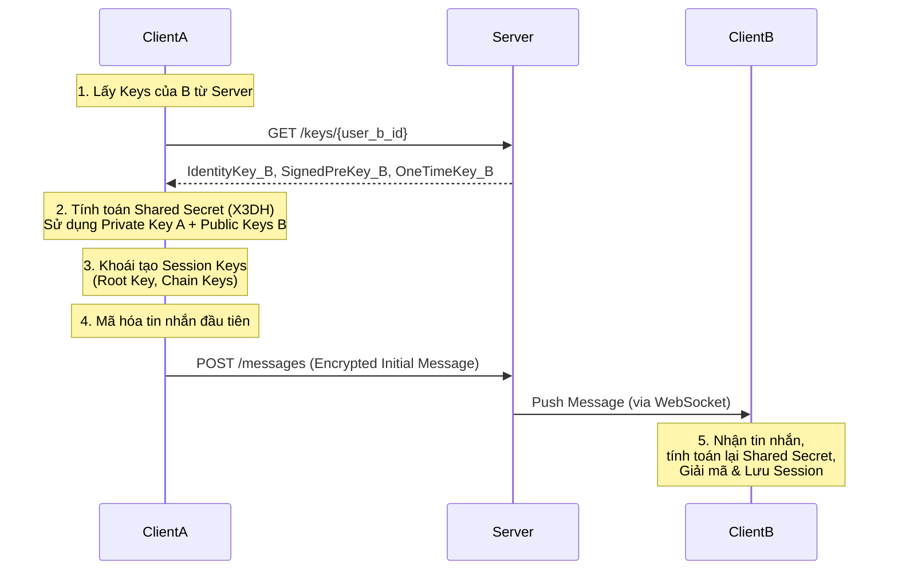

Dưới đây là nội dung chi tiết cho file **`03-security-architecture.md`**. Tài liệu này tập trung sâu vào cơ chế bảo mật, đặc biệt là việc triển khai **Signal Protocol** và mô hình bảo mật lai (Hybrid).

---

# 3. Security Architecture

**Project:** SecureConnect SaaS Platform  
**Version:** 1.0  
**Status:** Draft  
**Author:** System Architect

## 3.1. Tổng quan Kiến trúc Bảo mật

Hệ thống SecureConnect được thiết kế theo nguyên tắc **"Privacy by Default" (Riêng tư theo mặc định)**. Chúng tôi áp dụng kiến trúc bảo mật đa lớp (Defense in Depth), kết hợp giữa mã hóa đường truyền, mã hóa đầu cuối (E2EE), và kiểm soát truy cập nghiêm ngặt.

### 3.1.1. Triết lý "Hybrid Security"
Hệ thống cung cấp hai chế độ hoạt động linh hoạt để cân bằng giữa Bảo mật và Trải nghiệm thông minh:

1.  **Secure Mode (Mặc định):** Kích hoạt **End-to-End Encryption (E2EE)** sử dụng Signal Protocol. Máy chủ không thể đọc nội dung tin nhắn hay nghe lén cuộc gọi.
2.  **Intelligent Mode (Tùy chọn):** Tắt E2EE. Dữ liệu được mã hóa đường truyền (TLS 1.3) nhưng được giải mã tại Server để phục vụ AI (Recording, Transcription) và Search.

---

## 3.2. Các tiêu chuẩn Mã hóa (Cryptography Standards)

Chúng tôi sử dụng các thuật toán hiện đại, được kiểm chứng bởi cộng đồng bảo mật quốc tế.

| Mục đích | Thuật toán | Lý do chọn |
| :--- | :--- | :--- |
| **Trao đổi khóa (Key Exchange)** | **X25519 (Curve25519)** | Hiệu năng cao, an toàn trước các cuộc tấn công Side-channel. |
| **Chữ ký số (Digital Signatures)** | **Ed25519** | Tốc độ ký và xác thực cực nhanh, chữ ký nhỏ gọn. |
| **Mã hóa tin nhắn (Symmetric)** | **AES-256-GCM** | Cung cấp tính bảo mật và toàn vẹn dữ liệu (Authenticated Encryption). |
| **Mã hóa file (Symmetric)** | **ChaCha20-Poly1305** | Tối ưu cho thiết bị di động không có hỗ trợ phần cứng AES. |
| **Băm (Hashing)** | **SHA-512** | Khả năng chống va chạm (collision resistance) cao. |

---

## 3.3. Cơ chế Xác thực & Ủy quyền (AuthN & AuthZ)

### 3.3.1. Mô hình Token (JWT)
*   **Access Token:** Mã JWT ngắn hạn (ví dụ: 15 phút). Chứa thông tin `user_id`, `role`. Được gửi kèm mỗi Request.
*   **Refresh Token:** Mã ngẫu nhiên dài hạn (ví dụ: 30 ngày). Lưu trữ an toàn trong Database (CockroachDB) và chỉ dùng để lấy Access Token mới.

### 3.3.2. OAuth2 & Social Login
Hệ thống hỗ trợ đăng nhập qua bên thứ ba (Google, Apple, GitHub) theo chuẩn **OAuth 2.0 Authorization Code Flow**. Không lưu trữ mật khẩu xã hội, chỉ lưu `provider_user_id`.

### 3.3.3. Kiểm soát truy cập (RBAC)
*   **Role-Based Access Control:** Quyền hạn được gán theo Role: `User`, `Admin`, `Enterprise`.
*   **Scope-Based Access:** API Gateway kiểm tra scope của token trước khi cho phép truy cập resource (ví dụ: `read:messages`, `write:calls`).

---

## 3.4. End-to-End Encryption (E2EE) Architecture

Đây là thành phần cốt lõi nhất khi hệ thống ở chế độ `Secure Mode`. Chúng tôi triển khai biến thể của **Signal Protocol** (Double Ratchet Algorithm).

### 3.4.1. Thuật ngữ
*   **Identity Key Pair:** Cặp khóa dài hạn (Lifetime), dùng để xác thực danh tính.
*   **Signed Pre-Key:** Khóa trung hạn (báo hiệu hàng tuần), dùng để bắt đầu phiên hội thoại.
*   **One-Time Pre-Key:** Khóa dùng một lần (one-time), giúp tăng tính bảo mật cho lần kết nối đầu tiên.
*   **Root Key & Chain Key:** Các khóa phiên được tạo ra và thay đổi liên tục (Ratchet) sau mỗi tin nhắn.

### 3.4.2. Luồng trao đổi khóa (X3DH Protocol)

Khi User A muốn nhắn tin cho User B lần đầu tiên:

**Quy tắc quan trọng:**
*   **Server chỉ đóng vai trò kho công khai (Public Key Store).**
*   Server không bao giờ có khả năng tính toán lại Shared Secret vì thiếu Private Keys của người dùng.

### 3.4.3. Double Ratchet (Đánh ratchet kép)
Sau khi phiên chat đã được thiết lập (Session established):
*   **Symmetric-Key Ratchet:** Cập nhật `Chain Key` sau mỗi tin nhắn. Tin nhắn thứ N không thể dùng key của tin nhắn thứ N+1 để giải mã.
*   **DH Ratchet:** Cập nhật `Root Key` mỗi khi nhận thấy đối phương đã online/gửi tin nhắn mới. Điều này đảm bảo **Perfect Forward Secrecy (PFS)**. Nếu khóa bí mật bị lộ tại thời điểm T, mọi tin nhắn trước T vẫn an toàn.

---

## 3.5. Logic "Opt-out Encryption" (Tắt E2EE)

Khi người dùng chuyển chế độ sang `Intelligent Mode`, luồng bảo mật thay đổi như sau:

### Bảng so sánh trạng thái dữ liệu

| Layer | Secure Mode (E2EE ON) | Intelligent Mode (E2EE OFF) |
| :--- | :--- | :--- |
| **Network Transport** | **TLS 1.3** (Đây là bắt buộc) | **TLS 1.3** |
| **Application Payload** | **Ciphertext (AES-256)** | **Plaintext / Base64** |
| **Server Visibility** | Không thể đọc (Blind) | Có thể đọc & Xử lý |
| **AI Service** | Bị chặn (Block) | Kích hoạt (Active) |
| **Database Storage** | Lưu Ciphertext | Lưu Plaintext hoặc Server-side Encrypted |

### Xử lý Video Call
*   **E2EE ON:** WebRTC sử dụng **SRTP** với Inserting keys (DTLS handshake). SFU chỉ forward packet bit, không thể giải mã media.
*   **E2EE OFF:** SFU vẫn dùng SRTP, nhưng Key Exchange có thể cho phép Server Recording Service tham gia để nhận stream ghi âm.

---

## 3.6. Quản lý vòng đời khóa (Key Management Lifecycle)

### 3.6.1. Lưu trữ Key
*   **Private Keys (Flutter Client):**
    *   Được lưu trữ trong **Secure Enclave (iOS)** và **Keystore (Android)** thông qua package `flutter_secure_storage`.
    *   Không bao giờ rời khỏi thiết bị (trong RAM để xử lý, sau đó bị xóa ngay).
*   **Public Keys (Go Server):**
    *   Được lưu trong bảng `user_keys` của CockroachDB hoặc Redis Cache.

### 3.6.2. Làm mới khóa (Key Rotation)
Để đảm bảo an toàn nếu thiết bị bị cũ hoặc khóa bị lộ:
1.  **Signed Pre-Key:** Được làm mới (Rotate) mỗi **07 ngày**. Client sẽ đẩy khóa mới lên server và giữ lại khóa cũ trong một khoảng thời gian ngắn để hỗ trợ tin nhắn đang trôi nổi (in-flight messages).
2.  **One-Time Pre-Key:** Client sẽ nạp (upload) thêm keys khi số lượng keys còn lại dưới **20**.
3.  **Identity Key:** Chỉ thay đổi khi người dùng cài lại ứng dụng hoặc khôi phục bản sao lưu (Restore backup).

### 3.6.3. Xóa khóa & Dữ liệu (Forward Secrecy)
*   Khi người dùng xóa cuộc hội thoại: Client sẽ xóa `Session Keys` và `Chain Keys` khỏi bộ nhớ. Máy chủ chỉ xóa bản mã hóa (Ciphertext) khỏi Cassandra. Không thể khôi phục nội dung tin nhắn.

---

## 3.7. Bảo mật Vận chuyển (Transport Security)

### 3.7.1. HTTP & WebSocket
*   Bắt buộc sử dụng **HTTPS (TLS 1.3)** và **WSS (WebSocket Secure)**.
*   Cấu hình Nginx/Load Balancer để:
    *   Chỉ chấp nhận Cipher Suites mạnh (TLS_AES_256_GCM_SHA384).
    *   Bật HSTS (HTTP Strict Transport Security).
    *   Sử dụng OCSP Stapling.

### 3.7.2. WebRTC Media (Video/Audio)
*   Sử dụng **DTLS-SRTP** để mã hóa luồng media (RTP).
*   Mỗi cuộc gọi sử dụng keys riêng biệt, được tạo ra ngẫu nhiên qua DTLS handshake.

---

## 3.8. Bảo mật Lưu trữ (Data Security at Rest)

### 3.8.1. Database Encryption
*   **CockroachDB:** Hỗ trợ mã hóa dữ liệu tự động tại mức file (Encryption at Rest) bằng LUKS trên Linux hoặc Cloud KMS (AWS KMS, GCP KMS).
*   **Cassandra:** Cấu hình Transparent Data Encryption (TDE).

### 3.8.2. File Storage (Zero-Knowledge)
Ngay cả khi E2EE bị tắt, chúng tôi khuyến khích mã hóa file tải lên ở mức ứng dụng (Client-side Encryption) nếu dữ liệu nhạy cảm.

*   **Quy trình Upload an toàn:**
    1.  Client (Flutter) tạo khóa AES ngẫu nhiên.
    2.  Mã hóa file bằng khóa này.
    3.  Upload file đã mã hóa lên **MinIO**.
    4.  Mã hóa chính cái khóa AES đó bằng Public Key của người nhận (nếu chia sẻ) -> Lưu metadata này vào Database.
    *   *Kết quả:* MinIO chỉ lưu file rác. Kẻ tấn công vào MinIO không thể đọc được nội dung.

---

## 3.9. Mô hình mối đe dọa & Giảm thiểu (Threat Modeling)

### 3.9.1. Man-in-the-Middle (MITM) Attack
*   **Đe dọa:** Kẻ tấn công chặn tin nhắn và giả mạo server.
*   **Phòng ngừa:**
    *   Xác thực Public Keys thông qua so sánh "Safety Number" (Mã an toàn).
    *   TLS Certificate Pinning trong Flutter App (chỉ chấp nhận certificate cụ thể của server).

### 3.9.2. Replay Attack (Tái phát tấn công)
*   **Đe dọa:** Kẻ tấn công bắt tin nhắn cũ và gửi lại.
*   **Phòng ngừa:**
    *   Mỗi tin nhắn E2EE đều có `nonce` duy nhất.
    *   Server kiểm tra `timestamp` của tin nhắn, từ chối các tin nhắn quá cũ (ví dụ: > 5 phút).

### 3.9.3. Server Compromise (Máy chủ bị hack)
*   **Đe dọa:** Kẻ tấn công lấy toàn quyền kiểm soát DB và Source code.
*   **Phòng ngừa:**
    *   Với các hội thoại **Secure Mode (E2EE ON):** Kẻ tấn công chỉ lấy được bản mã hóa (Ciphertext). Không thể giải mã vì thiếu Private Keys của người dùng.
    *   Với các hội thoại **Intelligent Mode:** Dữ liệu có thể bị lộ. Do đó, cần cảnh báo rõ ràng trên UI khi người dùng tắt E2EE.

---

## 3.10. Tuân thủ & Kiểm toán (Compliance & Auditing)

### 3.10.1. Logging & Monitoring
*   Mọi hành động quan trọng (Login, Logout, Change E2EE Setting, Key Rotation) đều được ghi log (Audit Logs).
*   Log này được gửi đến **ELK Stack** hoặc **Splunk** và được bảo vệ nghiêm ngặt (chỉ Admin được xem).

### 3.10.2. GDPR & Data Privacy
*   **Right to be Forgotten (Quyền được quên):** Khi User xóa tài khoản, hệ thống sẽ:
    1.  Xóa User profile (CockroachDB).
    2.  Xóa Public Keys.
    3.  Đánh dấu dữ liệu tin nhắn để chạy CronJob xóa (xóa thật) khỏi Cassandra sau X ngày (hoặc ngay lập tức nếu tuân thủ yêu cầu).
    4.  Xóa file trên MinIO.

---

*Liên kết đến tài liệu tiếp theo:* `04-database-sharding-strategy.md`