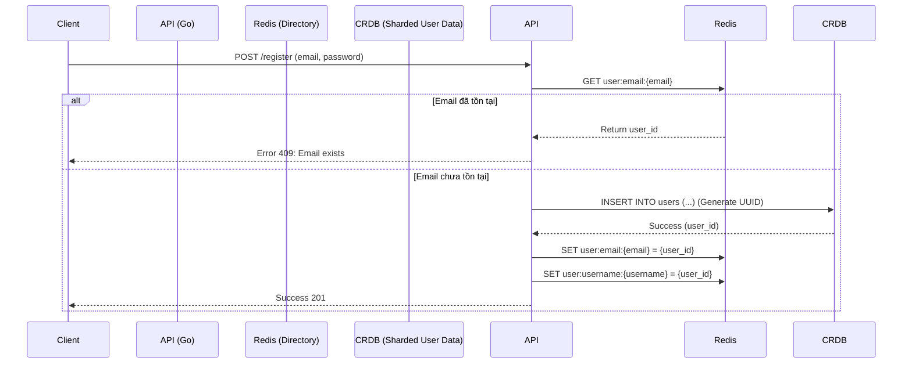

# 4. Database Sharding Strategy

**Project:** SecureConnect SaaS Platform  
**Version:** 1.0  
**Status:** Draft  
**Author:** System Architect

## 4.1. Tổng quan

Hệ thống SecureConnect được thiết kế để scale đến hàng triệu người dùng hoạt động đồng thời. Với lượng dữ liệu tin nhắn (Messages) và log cuộc gọi (Call Logs) tăng trưởng theo cấp số nhân, một Database đơn lẻ (Single Node) chắc chắn sẽ sập.

Chúng tôi áp dụng chiến lược **Polyglot Persistence** (Sử dụng nhiều loại DB) kết hợp với **Sharding** (Phân mảnh dữ liệu) và **Partitioning** (Phân vùng) để tối ưu hóa hiệu năng.

### 4.1.1. Mục tiêu thiết kế
1.  **High Write Throughput:** Hỗ trợ ghi 100,000+ tin nhắn/giây.
2.  **Low Latency Read:** Truy xuất lịch sử chat < 100ms.
3.  **Scalability:** Thêm node server mà không cần dừng hệ thống (Zero-downtime scaling).
4.  **Efficient Global Lookup:** Tra cứu `email` hoặc `username` nhanh chóng bất kể dữ liệu user nằm ở shard nào.

---

## 4.2. Định dạng Polyglot Data Layer

Chúng ta sử dụng 3 loại cơ sở dữ liệu chính, mỗi loại đảm nhận một nhiệm vụ phù hợp nhất với đặc tính của nó:

| Database | Vai trò chính | Kiểu dữ liệu lý tưởng |
| :--- | :--- | :--- |
| **CockroachDB** | Master Data (Users, Billing, Settings) | Cần độ chính xác cao (ACID), quan hệ phức tạp (JOIN), truy vấn ngẫu nhiên. |
| **Cassandra** | Messaging Data (Chat history, Call logs) | Time-series (dữ liệu theo thời gian), Write-heavy, Scale-out ngang. |
| **Redis** | Cache & Directory (Sessions, Metadata) | Đọc ghi cực nhanh, Key-Value đơn giản, hết hạn nhanh (TTL). |

---

## 4.3. Giải quyết bài toán "Global User Lookup"

### 4.3.1. Vấn đề (The Problem)
Nếu chúng ta Shard bảng `users` trong CockroachDB theo `user_id` (ví dụ: User A ở Shard 1, User B ở Shard 2), việc kiểm tra tính duy nhất của `email` toàn cục sẽ trở nên cực chậm. Khi User C đăng ký, hệ thống phải quét tất cả các shard để xem `email` đó đã tồn tại chưa.

### 4.3.2. Giải pháp (The Solution)
Sử dụng một **Global Directory Table** độc lập hoặc **Redis Cache** để tra cứu mapping `Email -> User ID` với độ phức tạp O(1).

### 4.3.3. Luồng Đăng ký User (Sơ đồ)



### 4.3.4. Cấu trúc dữ liệu Directory (Redis)
*   **Key:** `user:email:{email_address}`
*   **Value:** `{user_uuid}`
*   **TTL:** Không (Persist). Hoặc 24h nếu muốn backup lại từ DB.
*   **Lợi ích:** Việc check tồn tại email chỉ mất 1-2ms thay vì quét toàn bộ DB.

---

## 4.4. Chiến lược Sharding & Partitioning cho Messages (Cassandra)

Cassandra là NoSQL rộng cột (Wide-column store), không hỗ trợ truy vấn linh hoạt như SQL. Do đó, cách thiết kế Primary Key là sống còn.

### 4.4.1. Bài toán "Hot Partition"
Nếu chúng ta Partition chỉ theo `conversation_id`:
*   Một cuộc trò chuyện nhóm (Group Chat) công ty với 500 thành viên, hoạt động 24/7 có thể tạo ra hàng triệu tin nhắn.
*   Tất cả tin nhắn này đều nằm vào 1 Partition duy nhất trên 1 Node.
*   Node đó sẽ bị quá tải (Hotspot), trong khi các node khác rỗi rỗi.

### 4.4.2. Giải pháp: Bucketing (Theo thời gian)
Chúng ta chia nhỏ dữ liệu của một cuộc hội thoại thành nhiều "thùng" (buckets) dựa trên thời gian (tuần hoặc tháng).

**Schema (CQL):**
```sql
CREATE TABLE messages (
    conversation_id UUID,
    bucket INT,              -- Thời gian bucket: 202310 (năm tháng)
    message_id TIMEUUID,     -- ID tin nhắn unique theo thời gian
    sender_id UUID,
    encrypted_content TEXT,
    is_encrypted BOOLEAN,
    created_at TIMESTAMP,
    PRIMARY KEY ((conversation_id, bucket), created_at, message_id)
) WITH CLUSTERING ORDER BY (created_at DESC);
```

**Cách tính `bucket`:**
*   `bucket = YEAR(created_at) * 100 + MONTH(created_at)`
*   Ví dụ: Tin nhắn tháng 10/2023 sẽ có bucket `202310`.

**Lợi ích:**
*   Tin nhắn của tháng 10 nằm ở Partition A.
*   Tin nhắn của tháng 11 nằm ở Partition B (khác node).
*   Dữ liệu được phân tán tự nhiên, tải cân bằng.

---

## 4.5. Chiến lược Sharding cho Users (CockroachDB)

CockroachDB hỗ trợ Sharding tự động (Geo-partitioning) dựa trên Primary Key.

**Schema (SQL):**
```sql
CREATE TABLE users (
    user_id UUID PRIMARY KEY,  -- Partition Key mặc định
    email STRING,
    username STRING,
    public_key_ed25519 BYTES,
    created_at TIMESTAMP
);

-- Index để hỗ trợ tìm kiếm theo Username (trong phạm vi shard)
CREATE INDEX idx_users_username ON users (username);
```

### 4.5.1. Geo-Partitioning (Phân vùng địa lý)
Nếu hệ thống phục vụ khách hàng toàn cầu (US, EU, Asia), ta nên cấu hình dữ liệu user nằm gần vị trí họ nhất (để giảm latency).

```sql
-- Ví dụ lệnh (CockroachDB syntax)
ALTER PARTITION users ON INDEX users_pkey
    FOR VALUES WITH (REGION = 'us-east1', ZONE = 'us-east1-a');
```

---

## 4.6. Chính sách Replication (Sao chép dữ liệu) & Consistency

### 4.6.1. Cassandra (Eventual Consistency)
*   **Replication Factor (RF):** 3. Mỗi tin nhắn được lưu trên 3 node khác nhau để tránh mất dữ liệu nếu node hỏng.
*   **Consistency Level:**
    *   **Write:** `LOCAL_QUORUM`. Ghi thành công khi được ghi trên ít nhất 2/3 node trong cùng Datacenter. Đảm bảo không mất tin.
    *   **Read:** `LOCAL_QUORUM`. Đọc khi ít nhất 2/3 node phản hồi. Đảm bảo đọc được tin nhắn mới nhất vừa gửi.

### 4.6.2. CockroachDB (Strong Consistency)
*   CockroachDB đảm bảo **Serializable Isolation**. Đọc dữ liệu luôn là dữ liệu mới nhất vừa được ghi.
*   **Replication:** Tự động sao chép đồng bộ (Synchronous Replication) qua các node.

---

## 4.7. Quản lý vòng đời dữ liệu (Data Lifecycle & TTL)

Lưu trữ tin nhắn vĩnh viễn là lãng phí tiền bạc và rủi ro pháp lý.

### 4.7.1. TTL (Time To Live) trên Cassandra
Cấu hình tự động xóa tin nhắn cũ sau X ngày.
```sql
CREATE TABLE messages (
    ...
) WITH default_time_to_live = 2592000; -- 30 ngày (tính bằng giây)
```

*   **Hành vi:** Sau 30 ngày, Cassandra sẽ tự động đánh dấu xóa (Tombstone) và dọn dẹp dữ liệu trong quá trình `Compaction`. Không cần code backend để xóa thủ công.

### 4.7.2. Cơ chế "Soft Delete" & GDPR
Khi người dùng bấm "Xóa cuộc hội thoại" hoặc "Xóa tài khoản" (quyền được quên - Right to be Forgotten):
1.  Client gửi request `DELETE /messages`.
2.  **Cassandra:** Backend thực hiện lệnh `DELETE`. Dữ liệu biến mất ngay lập tức (tạo Tombstone).
3.  **Object Storage (MinIO):** Xóa các file ảnh/Video đính kèm.

---

## 4.8. Kịch bản Scale-out (Mở rộng quy mô)

Khi người dùng tăng đột biến, ta thêm hardware như thế nào?

### Bước 1: Tăng Redis Cluster (Session)
*   Thêm node Redis mới.
*   Re-sharding data trong Redis Cluster (tự động hoặc dùng redis-cli).

### Bước 2: Mở rộng Cassandra (Ghi tin nhắn)
*   Thêm node vào Cassandra Cluster.
*   Cassandra tự động rebalancing (chia lại các Partition) sang node mới.
*   **Lưu ý:** Không bao giờ sửa `Replication Factor` khi cluster đang quá tải.

### Bước 3: Mở rộng CockroachDB (User data)
*   Thêm node vào CockroachDB Cluster.
*   Hệ thống tự động move range dữ liệu sang node mới để cân bằng tải.

---

## 4.9. Tối ưu hóa Query (Query Optimization)

### Quy tắc vàng trong Cassandra:
1.  **Luôn cung cấp Partition Key đầy đủ** (`conversation_id` + `bucket`).
2.  **Không dùng `ALLOW FILTERING`** (sẽ quét toàn bộ DB - rất chậm).
3.  **Thiết kế Data Model dựa trên Query**, không dựa trên Entity (Denormalization).

**Ví dụ sai (Truy vấn tin nhắn của user):**
```sql
-- KHÔNG ĐƯỢC LÀM: Vì Partition Key là conversation_id
SELECT * FROM messages WHERE sender_id = 'user_123';
```

**Giải pháp (Dữ liệu phi chuẩn hóa):**
Tạo thêm một bảng `user_messages_by_sender` để phục vụ truy vấn này:
```sql
CREATE TABLE user_messages_by_sender (
    sender_id UUID,
    bucket INT,
    message_id TIMEUUID,
    conversation_id UUID,
    content TEXT,
    PRIMARY KEY ((sender_id, bucket), created_at)
) WITH CLUSTERING ORDER BY (created_at DESC);
```
Khi gửi tin nhắn, hệ thống sẽ ghi vào **CẢ HAI** bảng: `messages` (để load chat) và `user_messages_by_sender` (để tìm kiếm lịch sử người dùng).

---

*Liên kết đến tài liệu tiếp theo:*  `05-api-design.md`