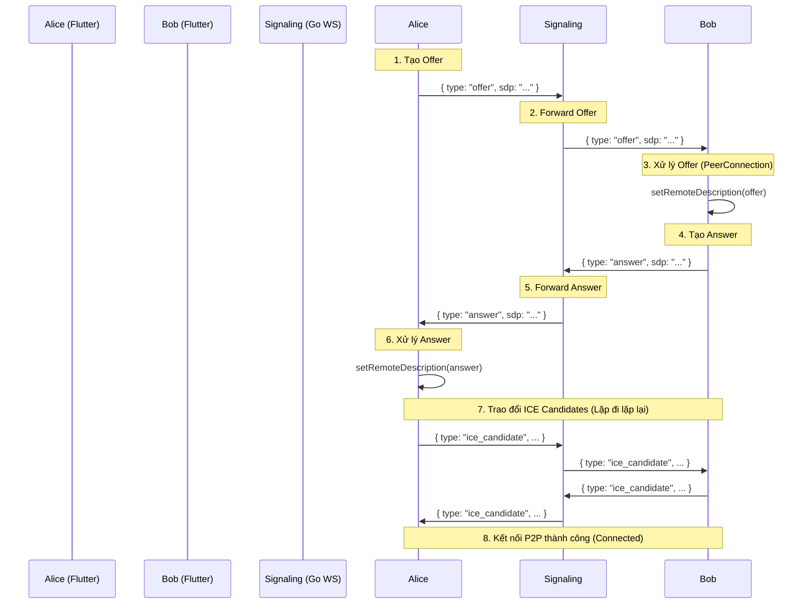

# 6. WebSocket Signaling Protocol

**Project:** SecureConnect SaaS Platform  
**Version:** 1.0  
**Status:** Draft  
**Author:** System Architect

## 6.1. Tổng quan

Để đảm bảo độ trễ thấp (Low Latency) cho Video Call và tính tức thời cho Chat, hệ thống sử dụng giao thức **WebSocket (WSS)**. Tuy nhiên, để tối ưu hiệu năng và quản lý tài nguyên, chúng tôi tách riêng 2 luồng kết nối:

1.  **Chat WebSocket Gateway:** Dùng cho văn bản, thông báo, trạng thái truy cập (Online/Typing).
2.  **Signaling WebSocket Gateway:** Dùng riêng cho WebRTC (Video/Audio Call) để trao đổi SDP và ICE Candidates.

### Các Endpoint
*   **Chat:** `wss://api.secureconnect.com/v1/ws/chat`
*   **Signaling:** `wss://api.secureconnect.com/v1/ws/signaling`

---

## 6.2. Chuẩn kết nối chung (Connection Standards)

Áp dụng cho cả 2 loại Gateway.

### 6.2.1. Handshake & Authentication
Client (Flutter) phải gửi JWT Access Token ngay khi thiết lập kết nối. Để đơn giản hóa qua các thư viện WS, chúng ta gửi token qua **Query Parameter**.

*   **URL Format:** `wss://...?token={JWT_TOKEN}&device_id={DEVICE_ID}`
*   **Logic Backend (Go):**
    1.  Parser token từ query param.
    2.  Verify JWT và lấy `user_id`.
    3.  Gán kết nối này vào `UserConnectionMap` (Redis hoặc Memory Map).
    4.  Nếu không hợp lệ -> Ngắt kết nối ngay lập tức (Close Frame 1008).

### 6.2.2. Heartbeat (Giữ kết nối sống)
Để tránh "Silent Drop" (kết nối bị ngắt mà không báo), cả 2 phía phải gửi ping.

*   **Client -> Server:** Gửi JSON `{ "type": "ping", "ts": 1698400000 }` mỗi 30 giây.
*   **Server -> Client:** Nếu Server không nhận được tin nhắn từ Client trong 60 giây -> Server gửi Close Frame và ngắt kết nối.
*   **Pong:** Server phản hồi `{ "type": "pong" }` khi nhận được ping.

---

## 6.3. Giao thức Chat WebSocket (Chat Protocol)

Dùng để đẩy tin nhắn và cập nhật trạng thái nhanh.

### 6.3.1. Luồng hoạt động
*   **Gửi tin nhắn:** Client nên dùng API REST `POST /messages` (để đảm bảo tin nhắn được lưu vào DB). Sau khi Server lưu thành công, Server sẽ đẩy tin nhắn đó cho người nhận qua WebSocket.
*   **Nhận tin nhắn:** Client chỉ lắng nghe (Subscribe) các event từ Server.

### 6.3.2. Các sự kiện (Events)

#### A. New Message (Tin nhắn mới)
Server đẩy khi có tin nhắn mới đến cho user này.

```json
{
  "type": "message_received",
  "payload": {
    "message_id": "uuid",
    "conversation_id": "uuid",
    "sender_id": "uuid",
    "sender_name": "Alice",
    "content": "Base64EncryptedString...", // (E2EE) hoặc Plaintext (Opt-out)
    "is_encrypted": true,
    "created_at": "2023-10-27T10:00:00Z",
    "ai_metadata": null // Chỉ có dữ liệu nếu is_encrypted=false
  }
}
```

#### B. Typing Indicator (Đang nhập...)
```json
{
  "type": "typing",
  "payload": {
    "conversation_id": "uuid",
    "user_id": "uuid",
    "is_typing": true
  }
}
```

#### C. Message Read (Đã đọc)
```json
{
  "type": "message_read",
  "payload": {
    "conversation_id": "uuid",
    "message_id": "uuid",
    "read_by": "uuid"
  }
}
```

#### D. Presence Update (Trạng thái online)
```json
{
  "type": "presence",
  "payload": {
    "user_ids": ["uuid1", "uuid2"],
    "status": "online", // online, offline, away
    "last_seen": "2023-10-27T10:00:00Z"
  }
}
```

---

## 6.4. Giao thức Signaling Video (WebRTC Protocol)

Đây là gateway riêng biệt cho video call. Yêu cầu độ trễ cực thấp, không được nghẽn bởi các sự kiện Chat.

### 6.4.1. Cấu trúc tham gia phòng (Room)
*   **Room ID:** Là `call_id` được tạo từ API REST `POST /calls/initiate`.
*   **Client Flow:**
    1.  Gọi API để tạo cuộc gọi -> Nhận `call_id`.
    2.  Kết nối WS: `wss://.../ws/signaling?token=...`
    3.  Gửi message `join` kèm `call_id`.

### 6.4.2. Các sự kiện (Signaling Events)

#### A. Join Room (Tham gia)
Client gửi để báo cho biết mình tham gia cuộc gọi này. Server sẽ broadcast sự kiện này cho những người đã có sẵn trong phòng.

**Client -> Server:**
```json
{
  "type": "join",
  "payload": {
    "call_id": "call_uuid_123",
    "sdp_capabilities": { ... } // Tùy chọn: Codec hỗ trợ (VP8, H264...)
  }
}
```

**Server -> Others:**
```json
{
  "type": "user_joined",
  "payload": {
    "user_id": "uuid_new_user",
    "display_name": "Bob"
  }
}
```

#### B. SDP Offer (Gửi lời mời kết nối)
Người tạo cuộc gọi (Caller) tạo offer và gửi qua Server để forward cho Callee.

**Client -> Server:**
```json
{
  "type": "offer",
  "payload": {
    "call_id": "call_uuid_123",
    "sdp": "v=0\r\no=- 123456789...", // Chuỗi SDP dài
    "target_user_id": "uuid_receiver" // (Tùy chọn: Nếu P2P 1-1)
  }
}
```

#### C. SDP Answer (Trả lời)
Người nhận cuộc gọi (Callee) tạo answer sau khi setRemoteDescription(offer).

**Client -> Server:**
```json
{
  "type": "answer",
  "payload": {
    "call_id": "call_uuid_123",
    "sdp": "v=0\r\no=- 987654321...",
    "target_user_id": "uuid_caller"
  }
}
```

#### D. ICE Candidate (Tìm đường đi)
Khi WebRTC tìm ra một đường đi mạng (host, srflx, relay), nó sẽ gửi candidate này đi. Quá trình này diễn ra song song với Offer/Answer.

**Client -> Server:**
```json
{
  "type": "ice_candidate",
  "payload": {
    "call_id": "call_uuid_123",
    "candidate": "candidate:1 1 UDP 2130706431 192.168.1.1 54400 typ host",
    "sdpMid": "0",
    "sdpMLineIndex": 0
  }
}
```

#### E. Leave Room (Rời phòng)
```json
{
  "type": "leave",
  "payload": {
    "call_id": "call_uuid_123"
  }
}
```

---

## 6.5. Xử lý lỗi & Mã đóng kết nối (Error Handling)

Khi Server đóng kết nối WebSocket, mã đóng (Close Code) theo chuẩn RFC 6455 được sử dụng kèm lý do.

| Code | Ý nghĩa | Hành động Client (Flutter) |
| :--- | :--- | :--- |
| **1000** | Normal Closure | Đóng kết nối, cleanup. |
| **1008** | Policy Violation (Token invalid) | Logout người dùng, bắt buộc đăng nhập lại. |
| **1011** | Internal Error | Thử kết nối lại (Reconnect) sau vài giây. |
| **1013** | Try Again Later | Server quá tải. Đợi vài giây rồi reconnect. |

### Chiến lược Reconnection trên Flutter
Kết nối Mobile/Web rất không ổn định. Client cần tự động reconnect:

1.  **Exponential Backoff:** Nếu mất kết nối, thử lại sau: 1s, 2s, 4s, 8s... tối đa 30s.
2.  **Queue tin nhắn:** Nếu người dùng bấm gửi trong lúc mất mạng, lưu message vào local queue (`hive`/`isar`). Khi kết nối lại -> Gửi lại qua REST API.
3.  **Resubscribe:** Khi kết nối lại Chat WS, Client phải gọi API `GET /conversations` để sync tin nhắn bị miss (nếu có). Đừng chỉ tin vào WS.

---

## 6.6. Sơ đồ trình tự Signaling Video (Sequence Diagram)



---

## 6.7. Bảo mật Signaling

1.  **Validate Room Membership:** Khi nhận một signaling message (ví dụ: Offer), Server (Go) phải kiểm tra trong Redis/DB xem: *User A có thực sự tham gia `call_id` XYZ không?* Nếu không -> Reject.
2.  **Rate Limiting:** Giới hạn số lượng gửi ICE Candidate hoặc Offer liên tục để tránh tấn công DDoS làm sập WebSocket server.
3.  **Payload Size:** Giới hạn kích thước JSON gửi qua WS (ví dụ: Max 64KB). SDP string có thể rất dài, cần xử lý cẩn thận hoặc chunking nếu cần thiết.

---

*Liên kết đến tài liệu tiếp theo:* `07-database-schema.md`