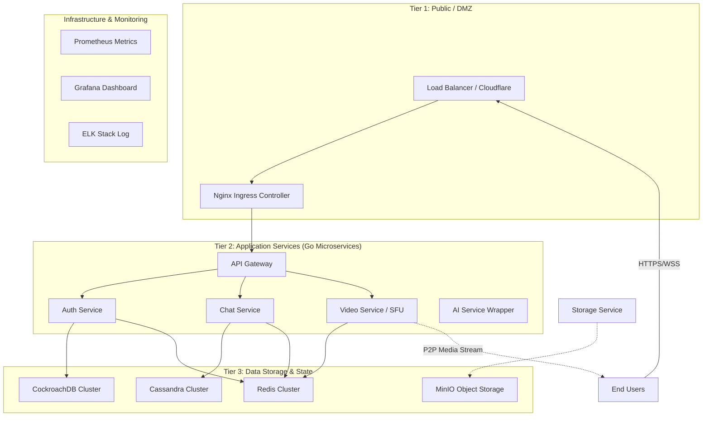
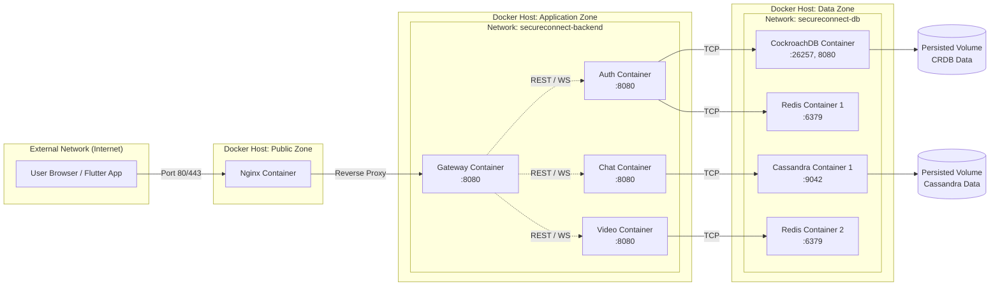
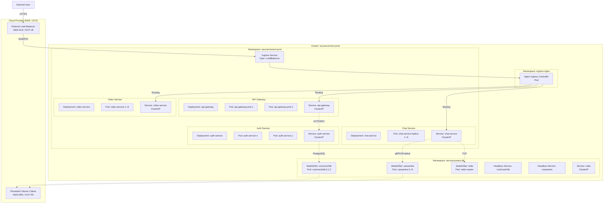
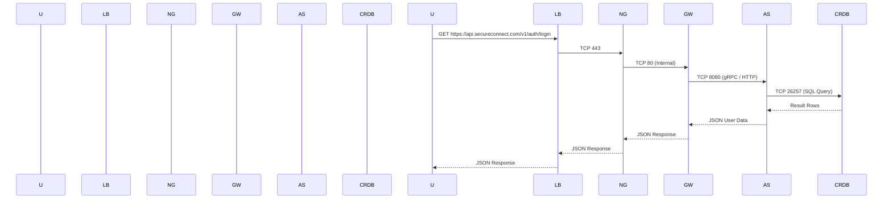
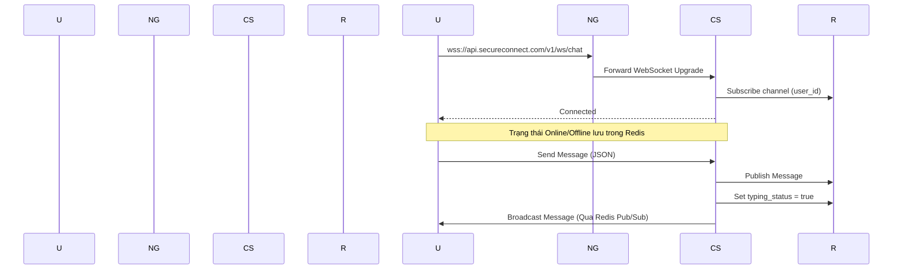
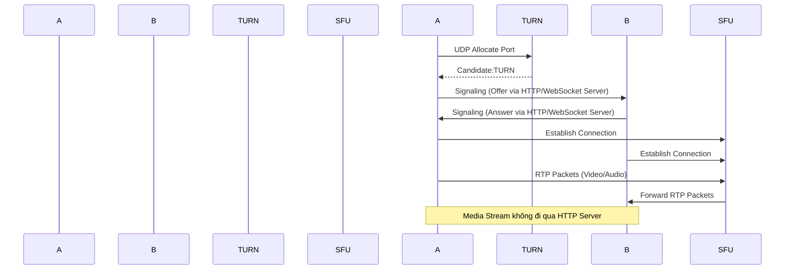

# Deployment Architecture Diagrams

**Project:** SecureConnect SaaS Platform  
**Version:** 1.0  
**Status:** Draft  
**Author:** System Architect

## 25.1. Tổng quan Chiến lược Triển khai (Deployment Strategy)

Hệ thống SecureConnect sử dụng kiến trúc **3-Tier Deployment** (Triển khai 3 lớp):

1.  **Public/DMZ Tier (Lớp công khai):** Load Balancer, Firewall, Nginx Ingress.
2.  **Application Tier (Lớp ứng dụng):** Các Microservices (Auth, Chat, Video) chạy trên Docker/Kubernetes.
3.  **Data Tier (Lớp dữ liệu):** Databases phân tán (Cassandra, CockroachDB) và Cache (Redis).

---

## 25.2. Sơ đồ Chi tách Server Logic (Logical Server Architecture)

Sơ đồ này mô tả cách chúng ta chia nhỏ hạ tầng vật lý hoặc VPS thành các nhóm chức năng riêng biệt để đảm bảo tính bảo mật và hiệu năng.



### Giải thích các nhóm Server:
1.  **Public Servers:** Chạy Nginx Ingress, chỉ mở port 80 (HTTP) và 443 (HTTPS).
2.  **App Servers:** Chạy các Docker container Go. Nằm trong mạng nội bộ (Private Network), chỉ có thể truy cập qua Ingress.
3.  **DB Servers:** Máy chủ chuyên dụng chạy Database, ưu tiên cấu hình IO cao (SSD/NVMe), chỉ cho phép App Servers kết nối thông qua Private IP.

---

## 25.3. Sơ đồ Kiến trúc Docker (Docker Deployment Architecture)

Sơ đồ này mô tả cách các Container Docker giao tiếp với nhau thông qua Docker Networks (Network Isolation).



### Docker Networks Isolation (Chi tiết cấu hình)
*   **secureconnect-frontend:** Network cho UI (không dùng trong PoC backend, nhưng có thể dùng cho Web Nginx).
*   **secureconnect-backend:** Chứa toàn bộ services Go. Các service này có thể giao tiếp với nhau qua tên container (ví dụ: `gw` gọi `auth`).
*   **secureconnect-db:** Chứa Database. Chỉ các container ở `backend` mới có thể kết nối vào network này.

---

## 25.4. Sơ đồ Kiến trúc Kubernetes (K8s Deployment Architecture)

Sơ đồ này phức tạp hơn, mô tả chi tiết cách các Pods, Services, và Ingress hoạt động trong một Cluster Kubernetes (ví dụ trên Google Cloud GKE hoặc AWS EKS).



### Giải thích các thành phần K8s:

1.  **Ingress Controller (`ingress-nginx`):**
    *   Đây là "Cửa ngõ" duy nhất của Cluster.
    *   Nó nhận HTTPs từ Internet và route đến các `Service` bên trong Cluster dựa trên `IngressRules` (Host: `api.secureconnect.com` -> Service: `api-gateway`).

2.  **Deployments vs Services:**
    *   **Deployment:** Quản lý các Pods (ví dụ: đảm bảo luôn có 2 replicas của `auth-service` đang chạy). Nếu Pod bị chết, Deployment sẽ tạo lại Pod mới.
    *   **Service:** Cung cấp một địa chỉ IP ổn định (ClusterIP) hoặc DNS cho các Pods. Ví dụ: `api-gateway` Service sẽ truy cập đến bất kỳ pod nào đang chạy của Deployment đó.

3.  **Namespace Separation:**
    *   `secureconnect-prod`: Chứa các services ứng dụng.
    *   `secureconnect-db`: Chứa các databases (Cassandra, CRDB). Tách biệt namespace giúp quản lý quyền truy cập (Quota tài nguyên) tốt hơn.

4.  **Persistent Volumes (PVC):**
    *   Dữ liệu Database (CRDB, Cassandra) được lưu trong PVC (được map tới các Block Storage trên Cloud Provider).
    *   Khi Pod Database bị khởi động lại (update version), dữ liệu vẫn còn ở PVC, không bị mất.

---

## 25.5. Luồng mạng chi tiết (Network Traffic Flow)

Để đảm bảo an toàn và hiệu quả, luồng dữ liệu đi qua các lớp như sau:

### Luồng 1: HTTP API (Chat, Auth)


### Luồng 2: Real-time WebSocket (Chat)


### Luồng 3: WebRTC Media (Video Call)
*   **Lưu ý:** Luồng Media (Video/Audio) sử dụng giao thức **SRTP** và chạy ngang (P2P hoặc qua SFU), **KHÔNG đi qua Ingress/HTTP**.



---

## 25.6. Quy mô Mở rộng (Scaling Diagram)

Khi lượng người dùng tăng, hệ thống mở rộng (Scale-out) theo chiều ngang (Horizontal Scaling) như sau:

```mermaid
graph LR
    subgraph "Phase 1: Initial Deployment"
        G1[Gateway: 1 Replica]
        A1[Auth: 2 Replicas]
        C1[Chat: 3 Replicas]
    end

    subgraph "Phase 2: Scale Up (Traffic x 2)"
        G2[Gateway: 2 Replicas]
        A2[Auth: 4 Replicas]
        C2[Chat: 6 Replicas]
    end

    subgraph "Phase 3: High Load (Scale Video)"
        G3[Gateway: 3 Replicas]
        A3[Auth: 6 Replicas]
        C3[Chat: 8 Replicas]
        V3[Video Service: 5 Replicas<br/>(CPU Heavy)]
    end

    %% Kubernetes HPA (Horizontal Pod Autoscaler) tự động thêm Pods dựa trên CPU/Metric
    subgraph "Kubernetes Cluster"
        K8S[Master Node<br/>Quản lý Schedule]
        W1[Worker Node 1]
        W2[Worker Node 2]
        W3[Worker Node 3]
    end

    %% Pods được phân bổ (Schedule) tự động qua các Node
    G2 --> W1
    A2 --> W1
    C2 --> W2
    V3 --> W3
```

---

## 25.7. Tóm tắt & Lưu ý triển khai

1.  **Tách biệt Network:** Luôn tách biệt mạng dữ liệu (Database) khỏi mạng ứng dụng (Backend). Không bao giờ để DB có IP công khai.
2.  **Ingress Controller:** Đừng để các Pods (Services) dùng `NodePort` để truy cập trực tiếp từ Internet. Luôn dùng `ClusterIP` kết hợp với `Ingress Controller` (Nginx) để bảo mật và quản lý SSL/SSL dễ dàng.
3.  **Persistent Storage:** Dữ liệu Database phải được gắn vào `PersistentVolumeClaim` (PVC). Đừng lưu DB vào container (OverlayFS) vì khi Pod bị chết, dữ liệu sẽ mất.
4.  **Resource Limits:** Luôn đặt `requests` và `limits` cho RAM/CPU cho Pods. Nếu không, một pod lỗi (Memory Leak) có thể ăn hết tài nguyên của cả Node, làm sập toàn bộ hệ thống.