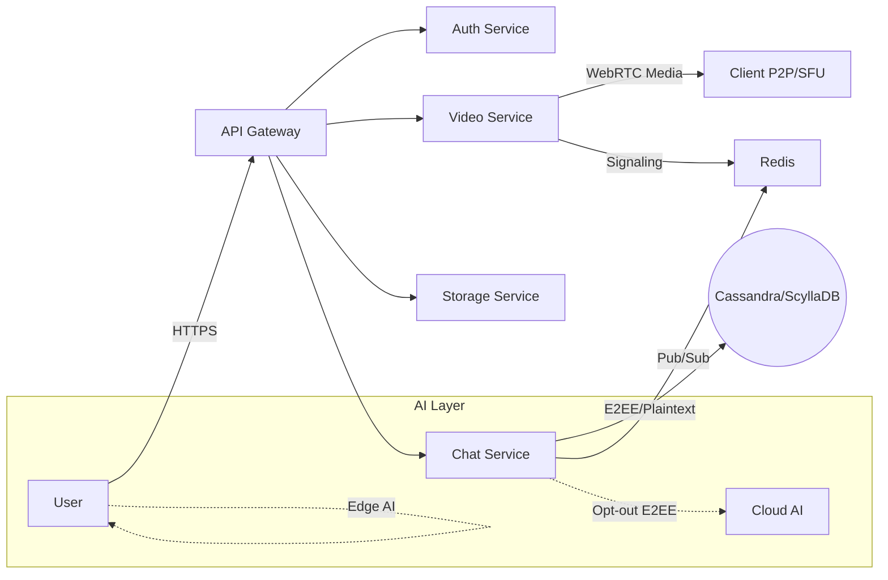

# SecureConnect SaaS Platform

<div align="center">


**Hệ thống nhắn tin bảo mật, Video Call & AI tích hợp - Kiến trúc Hybrid Security**

[Features](#-features) • [Architecture](#-kiến-trúc) • [Tech Stack](#-tech-stack) • [Quick Start](#-cài-đặt-nhanh) • [Documentation](#-tài-liệu-chi-tiết) • [Roadmap](#-roadmap)

</div>

---

## Giới thiệu (About)

**SecureConnect** là một nền tảng liên lạc SaaS thế hệ mới, được xây dựng để giải quyết bài toán cân bằng giữa **Bảo mật tuyệt đối** và **Trí tuệ nhân tạo**.

*   **Bảo mật:** Hỗ trợ mã hóa đầu cuối (E2EE) theo chuẩn Signal Protocol, đảm bảo tin nhắn của bạn không ai đọc được, kể cả nhà cung cấp dịch vụ.
*   **Thông minh:** Hỗ trợ chế độ "Opt-out Encryption" (Tắt mã hóa) để kích hoạt AI Cloud, hoặc sử dụng AI chạy trên thiết bị (Edge AI) để bảo mật và nhanh hơn.
*   **Đa nền tảng:** Ứng dụng xây dựng bằng **Flutter**, chạy mượt mà trên Web, iOS, Android, và Desktop (Windows/Mac/Linux).

Đây là dự án mã nguồn mở dùng cho mục đích học tập và nghiên cứu kiến trúc hệ thống phân tán quy mô lớn.

## ✨ Điểm nổi bật (Features)

*   **🔒 Mã hóa đầu cuối (E2EE):**
    *   Dùng thuật toán Double Ratchet (Signal Protocol).
    *   Hỗ trợ Safety Numbers để xác thực đối tác (chống MITM).
*   **📞 Video Call chất lượng cao:**
    *   Xây dựng hạ tầng SFU (Selective Forwarding Unit) bằng **Pion WebRTC** thuần Go.
    *   Hỗ trợ Screen Share, Picture-in-Picture.
    *   Hạ tầng chịu tải lớn (tối ưu hóa băng thông).
*   **🤖 AI tích hợp (Hybrid):**
    *   **Edge AI:** Gợi ý trả lời (Smart Reply) và phân tích cảm xúc chạy trực tiếp trên thiết bị người dùng.
    *   **Cloud AI:** Tóm tắt cuộc họp, dịch thuật thời gian thực (khi tắt E2EE).
*   **☁️ Ổ đĩa cá nhân (Cloud Drive):**
    *   Lưu trữ file mã hóa Zero-Knowledge (Server không thể đọc nội dung).
    *   Hỗ trợ upload/download tốc độ cao.
*   **🔗 Kết nối thời gian thực (Real-time):**
    *   WebSocket Gateway tách biệt cho Chat và Signaling Video.
    *   Độ trễ thấp (Low Latency).

## 🏗 Kiến trúc (Architecture)

Hệ thống được thiết kế theo mô hình **Microservices** với dữ liệu được phân mảnh (Sharding) toàn cầu.



*   **Backend:** Go (Golang).
*   **Frontend:** Flutter (Web/Mobile/Desktop).
*   **Database:** CockroachDB (OLTP), Cassandra (NoSQL Messages), Redis (Cache).

Chi tiết kiến trúc và mô hình dữ liệu được mô tả trong: [`docs/01-system-overview.md`](docs/01-system-overview.md)

## 🛠 Tech Stack

### Backend
*   **Ngôn ngữ:** Go 1.21+
*   **Framework:** Gin / Fiber (HTTP)
*   **WebSocket:** Gorilla WebSocket
*   **Video Engine:** Pion WebRTC (SFU)
*   **Database Drivers:** Gocql (Cassandra), PGX (CockroachDB), Go-Redis
*   **Crypto:** go-sodium, golang.org/x/crypto

### Frontend
*   **Framework:** Flutter 3.16+
*   **State Management:** Riverpod 2.4+
*   **Networking:** Dio, Web Socket Channel
*   **WebRTC:** flutter_webrtc
*   **Crypto:** cryptography, flutter_secure_storage
*   **AI:** google_ml_kit (Edge AI)

### Infrastructure
*   **Containerization:** Docker, Docker Compose
*   **Orchestration:** Kubernetes (K8s)
*   **CI/CD:** GitHub Actions
*   **Monitoring:** Prometheus, Grafana, ELK Stack
*   **Object Storage:** MinIO (S3 Compatible)

## 🚀 Cài đặt nhanh (Quick Start)

Đây là cách nhanh nhất để chạy hệ thống toàn diện trên máy cá nhân của bạn (Local Development) bằng Docker.

### Yêu cầu tiên quyết
*   Docker Engine >= 20.10
*   Docker Compose >= 2.0
*   (Tùy chọn) Make (để chạy các script tiện ích)

### Bước 1: Clone Repository
```bash
git clone https://github.com/your-username/secureconnect.git
cd secureconnect
```

### Bước 2: Khởi tạo Dữ liệu (Databases)
Chạy các container dữ liệu (CockroachDB, Cassandra, Redis, MinIO).
```bash
docker-compose up -d cockroachdb cassandra redis minio
```
*Đợi khoảng 10-20 giây để các database khởi động hoàn toàn.*

### Bước 3: Chạy Backend Services
Khởi động các dịch vụ Go (API Gateway, Auth, Chat, Video).
```bash
# Sử dụng Makefile để build và run
make run-local

# Hoặc chạy thủ công từng service
docker-compose up -d api-gateway auth-service chat-service video-service
```

### Bước 4: Chạy Frontend (Web)
```bash
# Chạy Web Flutter
cd web
flutter pub get
flutter run -d chrome
```

### Bước 5: Truy cập ứng dụng
*   **Frontend:** Mở trình duyệt tại `http://localhost:3000`.
*   **API:** Truy cập tại `http://localhost:8080`.
*   **CockroachDB Admin UI:** `http://localhost:8081` (User: `root`, Pass: để trống).
*   **MinIO Console:** `http://localhost:9001`.

## 📚 Tài liệu chi tiết (Documentation)

Hệ thống được tài liệu hóa chi tiết trong thư mục `docs/`. Đây là nơi chứa các hướng dẫn cho cả Backend (Go) và Frontend (Flutter).

### 1. Thiết kế & Kiến trúc (Architecture & Design)
*   [`docs/01-system-overview.md`](docs/01-system-overview.md) - Tổng quan hệ thống & Mô hình Hybrid Security.
*   [`docs/02-tech-stack-decision.md`](docs/02-tech-stack-decision.md) - Lý do chọn công nghệ (ADR).
*   [`docs/03-security-architecture.md`](docs/03-security-architecture.md) - Kiến trúc bảo mật & Signal Protocol.
*   [`docs/04-database-sharding-strategy.md`](docs/04-database-sharding-strategy.md) - Chiến lược phân mảnh DB.
*   [`docs/api-openapi-spec.yaml`](docs/api-openapi-spec.yaml) - Định nghĩa API chuẩn OpenAPI.

### 2. Backend - Go (Core Services)
*   [`docs/backend/project-structure.md`](docs/backend/project-structure.md) - Cấu trúc thư mục Go (Clean Architecture).
*   [`docs/backend/e2ee-implementation-guide.md`](docs/backend/e2ee-implementation-guide.md) - Hướng dẫn mã hóa khóa trên Server.
*   [`docs/backend/webrtc-sfu-guide.md`](docs/backend/webrtc-sfu-guide.md) - Hướng dẫn dựng SFU Video Call bằng Pion.
*   [`docs/backend/ai-service-integration.md`](docs/backend/ai-service-integration.md) - Tích hợp AI (OpenAI/LLM).
*   [`docs/backend/cassandra-integration-best-practices.md`](docs/backend/cassandra-integration-best-practices.md) - Tối ưu truy vấn Cassandra.

### 3. Frontend - Flutter (Client Apps)
*   [`docs/flutter/architecture-state-management.md`](docs/flutter/architecture-state-management.md) - Quản lý State với Riverpod.
*   [`docs/flutter/e2ee-client-side-guide.md`](docs/flutter/e2ee-client-side-guide.md) - Mã hóa/giải mã trên thiết bị.
*   [`docs/flutter/webrtc-ui-implementation.md`](docs/flutter/webrtc-ui-implementation.md) - Giao diện Video Call.
*   [`docs/flutter/edge-ai-setup.md`](docs/flutter/edge-ai-setup.md) - Triển khai AI chạy trên thiết bị.

### 4. DevOps & Triển khai (Infrastructure)
*   [`docs/devops/docker-setup.md`](docs/devops/docker-setup.md) - Dockerfiles cho Production.
*   [`docs/devops/kubernetes-manifests.md`](docs/devops/kubernetes-manifests.md) - Các file YAML deploy lên K8s.
*   [`docs/devops/ci-cd-pipeline.md`](docs/devops/ci-cd-pipeline.md) - Tự động hóa CI/CD với GitHub Actions.

### 5. Kiểm thử & Bảo trì (QA & Maintenance)
*   [`docs/qa/testing-strategy.md`](docs/qa/testing-strategy.md) - Chiến lược test (Unit, E2E, Performance).
*   [`docs/maintenance/troubleshooting-guide.md`](docs/maintenance/troubleshooting-guide.md) - Hướng dẫn xử lý sự cố thường gặp.
*   [`docs/maintenance/on-call-runbook.md`](docs/maintenance/on-call-runbook.md) - Sổ tay kỹ sư trực (On-Call).

## 🗺 Cấu trúc dự án (Project Structure)

```bash
secureconnect/
├── cmd/                     # Entry points cho Go Services
│   ├── api-gateway/
│   ├── auth-service/
│   ├── chat-service/
│   └── video-service/
├── internal/                # Private application code (Go)
│   ├── auth/
│   ├── chat/
│   ├── video/
│   └── crypto/
├── pkg/                      # Public libraries (Go)
├── web/                      # Flutter Web App
├── mobile/                   # Flutter Mobile App (iOS/Android)
├── desktop/                  # Flutter Desktop App (Windows/Mac)
├── docs/                     # 📚 Hệ thống tài liệu chi tiết (Quan trọng!)
├── deployments/              # K8s & Docker configs
│   ├── docker/
│   └── k8s/
├── scripts/                   # Utility scripts
├── go.mod
├── go.sum
└── README.md
```

## 🗓 Roadmap (Lộ trình phát triển)

### [x] Phase 1: Foundation (Hoàn thành)
- [x] Thiết kế kiến trúc tổng thể.
- [x] Lựa chọn Tech Stack.
- [x] Thiết kế Schema Database.
- [x] Thiết kế API Specification.

### [ ] Phase 2: Core Implementation (Đang thực hiện)
- [ ] Backend: Triển khai Auth & Chat Services.
- [ ] Frontend: Triển khai UI cơ bản và WebSocket.
- [ ] Backend: Triển khai Video Service (Pion SFU).
- [ ] Backend: Triển khai E2EE (Signal Protocol) cho Chat.

### [ ] Phase 3: Advanced Features
- [ ] Frontend: Triển khai Edge AI (Smart Reply).
- [ ] Backend: Tích hợp Cloud AI (OpenAI) cho Opt-out mode.
- [ ] Frontend: Triển khai Screen Sharing & Video Controls.
- [ ] Backend: Triển khai File Storage (MinIO).

### [ ] Phase 4: Production Readiness
- [ ] Dockerize toàn bộ hệ thống.
- [ ] Deploy lên Kubernetes.
- [ ] Setup CI/CD Pipeline.
- [ ] Performance Testing & Optimization.

## 🤝 Đóng góp (Contributing)

Chúng ta rất hoan nghênh các đóng góp từ cộng đồng! Nếu bạn muốn cải thiện hệ thống:

1.  Fork dự án.
2.  Tạo một nhánh feature mới (`git checkout -b feature/AmazingFeature`).
3.  Commit thay đổi của bạn (`git commit -m 'Add some AmazingFeature'`).
4.  Đẩy lên nhánh (`git push origin feature/AmazingFeature`).
5.  Mở một Pull Request.

Xin vui lòng tuân thủ **Code of Conduct** và đảm bảo tất cả các Unit Tests đều pass.

## 📄 Giấy phép (License)

Dự án này được cấp phép theo **Private License**. Sử dụng cho mục đích học tập và nội bộ. Không được phép sử dụng cho mục đích thương mại mà không có sự đồng ý bằng văn bản.

## 📧 Liên hệ (Contact)

*   **System Architect:** [Tên của bạn] - [Email của bạn]
*   **GitHub:** [@your-username](https://github.com/your-username)

---

<div align="center">
  <sub>Built with ❤️ by SecureConnect Team</sub>
</div>